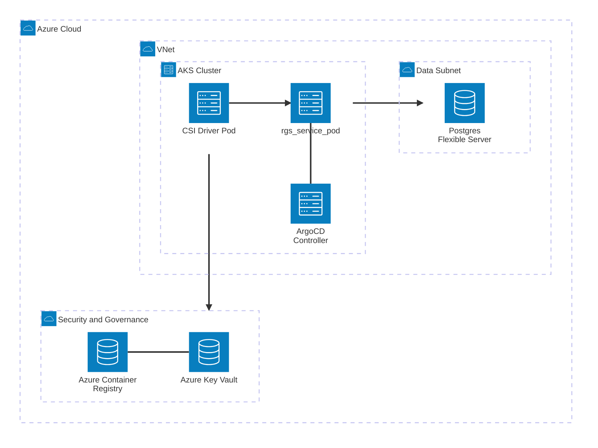
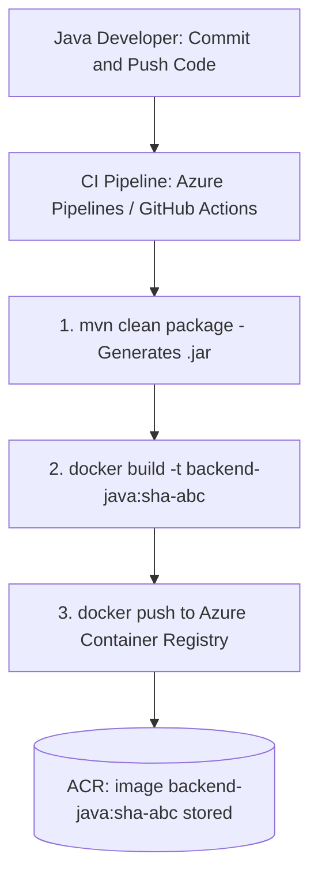
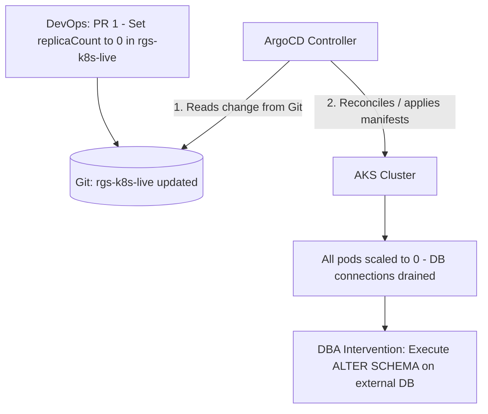
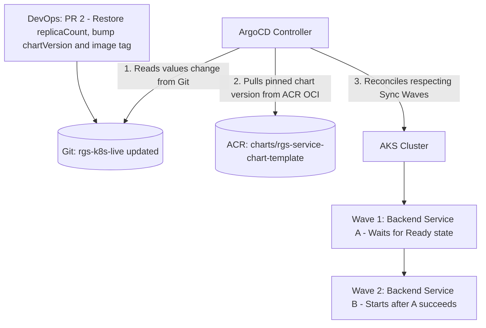

# 🏛️ Architectural Blueprint: GitOps, IaC & Coordinated Release Strategy

**Target:** Java Backend Applications on Azure Kubernetes Service (AKS) via ArgoCD
**Document Status:** Draft (DevOps Reference)

---

## 1. Network Architecture & Azure Components

The infrastructure architecture leverages Microsoft managed services in PaaS mode, securely integrated within a Virtual Network (VNet). Authentication between components is handled via Azure Managed Identities, eliminating static passwords from the infrastructure.



> **Note:** This diagram uses Mermaid's experimental `architecture-beta` syntax. It only ships with a small set of default icons (`cloud`, `database`, `disk`, `internet`, `server`) and does **not** support edge labels, so the connection semantics (JDBC, secret request, secret injection) are described in the text below rather than on the arrows. If your Markdown renderer does not support `architecture-beta`, revert to the standard `flowchart` version.

---

## 2. Git Repository Structure

Corporate governance enforces a **strict separation** across three repositories: the Java application source code, the reusable Terraform **modules**, and the **live** environment configuration (Terragrunt + GitOps manifests). Keeping modules and live config in distinct repositories is the Gruntwork best practice: modules are versioned and released with Git tags, and the live repo pins each environment to a specific module version.

### A. Java Application Code Repository: `rgs-<service>`

*Managed exclusively by software developers. Contains zero Kubernetes or Helm logic. One repository per microservice, e.g. `rgs-wallet`, `rgs-catalog`, `rgs-payment`.*

```text
rgs-<service>/
├── .github/
│   └── workflows/                     # CI pipeline: compile, test, push Docker image
│                                      # (or azure-pipelines.yml)
├── src/
│   └── main/
│       ├── java/
│       │   └── com/company/backend/   # Java source (Spring Boot / Quarkus / Java Core)
│       └── resources/
│           └── application.yml        # Reads config from env vars (e.g. ${DB_PASSWORD})
├── pom.xml                            # Dependency management (or build.gradle)
└── Dockerfile                         # Multi-stage build for an optimized runtime image
```

The `application.yml` never hardcodes secrets: every sensitive value is read from an environment variable that Kubernetes injects at runtime (see Section 6). Secrets are not limited to the database — they include third-party API keys, message-broker credentials, and signing keys.

```yaml
# src/main/resources/application.yml
spring:
  application:
    name: rgs-wallet
  datasource:
    url: jdbc:postgresql://${DB_HOST}:5432/${DB_NAME}
    username: ${DB_USER}
    password: ${DB_PASSWORD}          # injected from Key Vault via CSI driver

# Application-specific secrets (not DB related)
rgs:
  payment-gateway:
    api-key: ${PAYMENT_API_KEY}       # third-party provider key, injected secret
  redis:
    password: ${REDIS_PASSWORD}       # cache credential, injected secret
```

### B. Terraform Modules Repository: `rgs-k8s-modules`

*Reusable, environment-agnostic Terraform modules. Contains no backend or environment values. Each release is tagged (e.g. `v1.0.0`) and consumed by the live repo via a pinned Git ref.*

```text
rgs-k8s-modules/
├── aks/                               # AKS cluster creation (enables CSI add-on)
│   ├── main.tf
│   ├── variables.tf
│   └── outputs.tf
└── argocd-bootstrap/                  # Installs ArgoCD + root App-of-Apps, KV role assignment
    ├── main.tf
    ├── variables.tf
    └── outputs.tf
```

### C. Live / GitOps Repository: `rgs-k8s-live`

*Managed by the DevOps team. Represents the single Source of Truth for the cluster state. Holds the Terragrunt environment configuration plus the ArgoCD application manifests and Helm values. Example below shows a single `prod` environment.*

```text
rgs-k8s-live/
├── .github/
│   └── workflows/
│       └── publish-chart.yml          # Dedicated GH Action: helm package + push to ACR (OCI)
├── terragrunt.hcl                     # Root config: remote state backend + provider generation
├── environments/
│   └── prod/
│       ├── env.hcl                    # Prod-wide inputs (location, subscription, tags)
│       ├── aks/
│       │   └── terragrunt.hcl         # Calls rgs-k8s-modules//aks (pinned ref)
│       └── argocd/
│           └── terragrunt.hcl         # Calls rgs-k8s-modules//argocd-bootstrap (depends on AKS)
├── argocd-apps/
│   └── prod/
│       ├── root-app.yaml              # Root Application monitoring the argocd-apps/prod folder
│       └── apps-definition.yaml       # ApplicationSet (multi-source) - see Section 5
└── kubernetes/
    ├── shared-charts/
    │   └── rgs-service-chart-template/  # Chart SOURCE CODE (developed here, published to ACR)
    │       ├── Chart.yaml             # Chart metadata; the `version` field drives the OCI tag
    │       ├── values.yaml            # Default values (overridden per service/env)
    │       ├── .helmignore            # Files excluded from the packaged chart
    │       └── templates/
    │           ├── _helpers.tpl       # Shared template helpers (labels, names)
    │           ├── deployment.yaml    # Pod spec, image, env vars, secret volume mounts
    │           ├── service.yaml       # ClusterIP service exposing the pod
    │           ├── ingress.yaml       # Ingress / route definition (optional)
    │           ├── hpa.yaml           # HorizontalPodAutoscaler (optional)
    │           ├── serviceaccount.yaml # Workload-identity-bound ServiceAccount
    │           └── secret-provider.yaml # SecretProviderClass linking CSI driver to Key Vault
    └── environments-values/
        └── prod/
            ├── backend-service-a.yaml # Values + pinned chartVersion (PR target for releases)
            └── backend-service-b.yaml # Values for service B
```

> **Chart distribution model.** The chart *source code* lives in `rgs-k8s-live`, but it is **not consumed from Git** at deploy time. A dedicated GitHub Action (`publish-chart.yml`) packages it and pushes it to **ACR as a versioned OCI artifact**. ArgoCD then pulls the chart **by version** from ACR (source 1) and the per-service values **from Git** (source 2) — see the multi-source `ApplicationSet` in Section 5. This decouples *what to deploy* (immutable, versioned chart on ACR) from *how to configure it* (values on Git), and keeps the blast radius of a chart change under explicit version control.

---

## 3. Infrastructure Automation (Terragrunt & Terraform)

Initial provisioning of the cluster and CD tools is orchestrated by Terragrunt. The reusable modules live in `rgs-k8s-modules`; the `rgs-k8s-live` repo pins each environment to a tagged module version. Decoupling components into separate modules prevents resource dependency loops during provider initialization.

### A. AKS Module (`rgs-k8s-modules/aks/main.tf`)

Natively enables the Microsoft-managed add-on for Azure Key Vault integration.

```hcl
resource "azurerm_kubernetes_cluster" "aks" {
  name                = var.cluster_name
  location            = var.location
  resource_group_name = var.resource_group_name
  dns_prefix          = var.cluster_name

  default_node_pool {
    name       = "default"
    node_count = var.node_count
    vm_size    = var.vm_size
  }

  # NATIVE SECRETS STORE CSI DRIVER ACTIVATION
  key_vault_secrets_provider {
    secret_rotation_enabled  = true
    secret_rotation_interval = "2m"
  }

  identity {
    type = "SystemAssigned"
  }
}

output "kube_config" {
  value     = azurerm_kubernetes_cluster.aks.kube_config_raw
  sensitive = true
}

output "csi_identity_client_id" {
  value = azurerm_kubernetes_cluster.aks.key_vault_secrets_provider.secret_identity.client_id
}
```

### B. Terragrunt Environment Configuration (`rgs-k8s-live/environments/prod/argocd/terragrunt.hcl`)

Handles sequential orchestration: extracts AKS outputs and injects them into the ArgoCD bootstrap module. The module `source` points to the tagged release in the modules repository.

```hcl
include "root" {
  path = find_in_parent_folders()
}

terraform {
  source = "git::git@github.com:rgs/rgs-k8s-modules.git//argocd-bootstrap?ref=v1.0.0"
}

dependency "aks" {
  config_path = "../aks"
}

inputs = {
  kubernetes_host        = dependency.aks.outputs.kube_config_host
  client_certificate     = dependency.aks.outputs.kube_config_client_certificate
  client_key             = dependency.aks.outputs.kube_config_client_key
  cluster_ca_certificate = dependency.aks.outputs.kube_config_cluster_ca_certificate
  csi_addon_client_id    = dependency.aks.outputs.csi_identity_client_id
  keyvault_id            = "/subscriptions/00000000/resourceGroups/rg-prod/providers/Microsoft.KeyVault/vaults/kv-prod-java"
  gitops_repo_url        = "https://github.com"
}
```

### C. ArgoCD Bootstrap Module & Security Assignment (`rgs-k8s-modules/argocd-bootstrap/main.tf`)

Installs ArgoCD via Helm and configures the security authorization for Azure Key Vault.

```hcl
# Authorize the AKS CSI Driver Identity to read secrets inside the Azure Key Vault
resource "azurerm_role_assignment" "csi_kv_reader" {
  scope                = var.keyvault_id
  role_definition_name = "Key Vault Secrets User"
  principal_id         = var.csi_addon_client_id
}

# Install official ArgoCD via Helm
resource "helm_release" "argocd" {
  name             = "argocd"
  repository       = "https://github.io"
  chart            = "argo-cd"
  version          = "7.7.0"
  namespace        = "argocd"
  create_namespace = true
}

# Define the Root Application (App-of-Apps)
resource "kubernetes_manifest" "root_application" {
  depends_on = [helm_release.argocd]
  manifest = {
    apiVersion = "argoproj.io/v1alpha1"
    kind       = "Application"
    metadata = {
      name      = "root-apps"
      namespace = "argocd"
    }
    spec = {
      project = "default"
      source = {
        repoURL        = var.gitops_repo_url
        targetRevision = "HEAD"
        path           = "argocd-apps/prod"
      }
      destination = {
        server    = "https://default.svc"
        namespace = "argocd"
      }
      syncPolicy = {
        automated = {
          prune    = true
          selfHeal = true
        }
      }
    }
  }
}
```

---

## 4. End-to-End Pipeline: Continuous Integration & Continuous Delivery

The software life cycle is divided into distinct automation tracks. The CI pipeline archives two immutable artifacts on **ACR** — the application **container image** and the versioned **Helm chart (OCI)** — while ArgoCD handles pull-request-driven reconciliation (CD), pulling the chart from ACR by version and the values from Git. The flow is split into stages: CI (image build + chart publish), the pre-release (drain) stage, and the release (restore) stage.

### Stage 1 — Continuous Integration (Build & Push to ACR)

The developer commits and pushes the code; the CI pipeline compiles, builds the image, and publishes the immutable artifact to Azure Container Registry. No cluster change happens here.



### Stage 1b — Chart Publishing (Helm chart to ACR as OCI)

A **separate, dedicated GitHub Action** in `rgs-k8s-live` publishes the Helm chart as a versioned OCI artifact. It runs **only when the chart source changes** (`paths:` filter), packages it, and pushes it to ACR using the `version` declared in `Chart.yaml`. Authentication uses OIDC — no static client secret.

```yaml
# rgs-k8s-live/.github/workflows/publish-chart.yml
name: Publish Helm Chart to ACR

on:
  push:
    branches: [main]
    paths:
      - "kubernetes/shared-charts/rgs-service-chart-template/**"   # only when the chart changes

permissions:
  id-token: write        # OIDC to Azure (no static secrets)
  contents: read

jobs:
  publish:
    runs-on: ubuntu-latest
    steps:
      - uses: actions/checkout@v4

      - name: Azure login (OIDC)
        uses: azure/login@v2
        with:
          client-id: ${{ vars.AZURE_CLIENT_ID }}
          tenant-id: ${{ vars.AZURE_TENANT_ID }}
          subscription-id: ${{ vars.AZURE_SUBSCRIPTION_ID }}

      - name: ACR login
        run: az acr login --name acrrgs

      - name: Read chart version
        id: chart
        run: echo "version=$(yq '.version' kubernetes/shared-charts/rgs-service-chart-template/Chart.yaml)" >> "$GITHUB_OUTPUT"

      - name: Helm package
        run: helm package kubernetes/shared-charts/rgs-service-chart-template

      - name: Helm push (OCI)
        run: |
          helm push \
            rgs-service-chart-template-${{ steps.chart.outputs.version }}.tgz \
            oci://acrrgs.azurecr.io/charts
```

*Result:* the chart is available at `oci://acrrgs.azurecr.io/charts/rgs-service-chart-template:<version>`. Enabling **tag immutability** on ACR prevents an existing version from being overwritten. A release is then triggered by bumping the pinned `chartVersion` in the per-service values files (see Section 5).

### Stage 2 — Pre-Release Flow (CD: Drain to Zero + DBA Intervention)

DevOps merges a PR that sets all replicas to `0` in the live repo. ArgoCD detects the Git change and reconciles the cluster, terminating the pods. With the database fully drained, the DBAs apply the schema changes safely.



### Stage 3 — Release Flow (CD: Restore Replicas + Pin Chart Version / Image Tags)

Once the DBAs confirm success, DevOps merges a second PR that restores the replica count and updates each service's values file — pinning the new `chartVersion` (published in Stage 1b) and the new image `tag`. ArgoCD detects the Git change, pulls the pinned chart version from ACR, and reconciles the cluster, rolling out the new pods respecting Sync Waves.



---

## 5. Coordinated Release Strategy ("Maintenance Window GitOps")

When a release requires breaking or non-backwards-compatible schema updates on the external database (e.g., `ALTER SCHEMA`), a strict sequence guided by separate Pull Requests is applied to drain traffic and let DBAs operate safely.

### ArgoCD Sync Waves Behavior

ArgoCD organizes resource synchronization in ascending order based on the `argocd.argoproj.io/sync-wave` annotation value.

* A subsequent wave (e.g., `Wave 2`) starts **if and only if** all resources in the previous wave (`Wave 1`) are classified as **`Healthy`** (meaning they successfully passed their Kubernetes Readiness Probes).

### Phase 1: Pre-Release PR (Opening the Maintenance Window)

The DevOps team opens a Pull Request to scale application replicas down to zero in the environment configuration files. The image tag remains unchanged for now.

```yaml
# kubernetes/environments-values/prod/backend-service-a.yaml
replicaCount: 0 # Shuts down all active pods in the cluster
image:
  tag: "v1-old"
```

*Result:* ArgoCD terminates the pods. The external database is completely isolated from application connections. The ArgoCD dashboard transitions to a clean Synced state.

### Phase 2: Manual / Scripted DBA Intervention

DBAs have the mathematical certainty that no application code is active. They execute structural changes on the external database PaaS.

If the operation fails: The maintenance window is aborted by scaling replicas back to 3 using the old code version. The database is not corrupted by concurrent application transactions.

> **Possible evolution — automate the DBA step with an ArgoCD PreSync Hook.** Today Phase 2 is a manual step outside the GitOps loop. ArgoCD natively supports **Resource Hooks** (`PreSync` / `Sync` / `PostSync`) that run a task at a precise point of the sync process. The schema change could be modeled as a **PreSync Job** (e.g. Liquibase/Flyway) that runs *before* the Wave 1 rollout, so ArgoCD proceeds with restarting the pods **only if the migration succeeds** — folding the database change into the same Git-driven release instead of a manual intervention.
>
> ```yaml
> apiVersion: batch/v1
> kind: Job
> metadata:
>   name: db-schema-migration
>   annotations:
>     argocd.argoproj.io/hook: PreSync               # runs BEFORE the rollout
>     argocd.argoproj.io/hook-delete-policy: HookSucceeded
> spec:
>   template:
>     spec:
>       containers:
>         - name: liquibase
>           image: rgs/db-migrator:1.4.0
>           command: ["liquibase", "update"]
>       restartPolicy: Never
> ```
>
> **Caveat:** a standard PreSync hook runs before the rollout but does not by itself drain the *previous* version's pods, which is why we currently keep the manual maintenance window. Full automation would require the hook to also scale the old replicas to zero before migrating. This is a native ArgoCD capability that **Flux does not provide out of the box** (it would rely on Helm hooks or external Jobs).

### Phase 3: Release PR (Coordinated Wave Restart)

As soon as the DBAs give the green light, the second PR is merged. This PR restores the pod capacity and pins the new `chartVersion` (published to ACR in Stage 1b) along with the image tags compiled during the CI stage.

### Wave Configuration in the App-of-Apps (`argocd-apps/prod/apps-definition.yaml`)

Instead of hand-written static `Application` objects, an **`ApplicationSet`** discovers every values file under `environments-values/prod/` and generates one **multi-source** `Application` per service. Each generated app reads the **chart from ACR (OCI), pinned to a version** (source 1) and its **values from Git** (source 2). The `chartVersion` and Sync Wave are read from each values file.

```yaml
apiVersion: argoproj.io/v1alpha1
kind: ApplicationSet
metadata:
  name: rgs-services
  namespace: argocd
spec:
  goTemplate: true
  generators:
    - git:
        repoURL: https://github.com/rgs/rgs-k8s-live.git
        revision: HEAD
        files:
          - path: "kubernetes/environments-values/prod/*.yaml"   # ONLY this folder is watched for discovery
  template:
    metadata:
      name: "prod-{{ .path.basenameNormalized }}"               # e.g. prod-backend-service-a
      annotations:
        argocd.argoproj.io/sync-wave: "{{ .syncWave }}"          # wave read from the values file
    spec:
      project: default
      sources:
        # --- Source 1: the CHART, pulled from ACR (OCI), pinned to a version ---
        - repoURL: acrrgs.azurecr.io/charts
          chart: rgs-service-chart-template
          targetRevision: "{{ .chartVersion }}"                  # version = release trigger
          helm:
            valueFiles:
              - "$values/{{ .path.path }}/{{ .path.filename }}"
        # --- Source 2: the VALUES, from Git, exposed via the $values ref ---
        - repoURL: https://github.com/rgs/rgs-k8s-live.git
          targetRevision: HEAD
          ref: values
      destination:
        server: https://kubernetes.default.svc
        namespace: prod
      syncPolicy:
        automated:
          prune: true
          selfHeal: true
```

**How the dual trigger works:**

* **Edit a values file** in Git → only that service's app goes `OutOfSync` and syncs.
* **Bump `chartVersion`** in one, some, or all values files → the affected apps pull the new chart version from ACR and roll out, respecting Sync Waves. A PR that bumps the version on every file redeploys all services in a controlled, wave-ordered way.
* **Editing the chart source code alone does NOT trigger anything** — ArgoCD watches the *OCI artifact by version* on ACR, not the chart code in Git. The rollout happens only after `publish-chart.yml` publishes the new version **and** a values PR pins it. This is what keeps the blast radius governed.

> Note on the `$values` ref: source 2 declares `ref: values` with no `path`/`chart`, so it produces no manifests on its own — it only mounts the Git repo as a filesystem that source 1 reads its `valueFiles` from via the `$values/...` prefix.

Each values file in `kubernetes/environments-values/prod/` pins the chart version and declares its wave:

```yaml
# kubernetes/environments-values/prod/backend-service-a.yaml
chartVersion: "1.5.0"   # pinned OCI chart version on ACR (release trigger)
syncWave: "1"           # Sync Wave for this service
replicaCount: 3         # Restores container instances
image:
  tag: "sha-abc"        # Injects the new Java v2 image compatible with the updated DB
```

---

## 6. Security & Secret Injection (Zero Secrets in Git)

The shared Helm chart (`rgs-service-chart-template`) includes the resource to connect the CSI driver to the Azure Key Vault, converting secrets into native Kubernetes Secrets without writing them in cleartext in code or repositories.

### Chart Manifest Definition (`templates/secret-provider.yaml`)

```yaml
apiVersion: secrets-store.csi.x-k8s.io/v1
kind: SecretProviderClass
metadata:
  name: {{ .Release.Name }}-kv-provider
spec:
  provider: azure
  parameters:
    usePodIdentity: "false"
    useVMManagedIdentity: "true"
    userAssignedIdentityID: "{{ .Values.csiIdentityClientId }}"
    keyvaultName: "{{ .Values.keyvaultName }}"
    objects: |
      array:
        - |
          objectName: db-password-secret
          objectType: secret
          objectVersion: ""
    tenantId: "{{ .Values.tenantId }}"
  secretObjects:
    - secretName: {{ .Release.Name }}-k8s-secret
      type: Opaque
      data:
        - objectName: db-password-secret
          key: DB_PASSWORD # Key exposed inside the cluster
```

### Consumption inside the Chart's `templates/deployment.yaml`

The Java microservice reads the mounted secret through a standard environment variable injected by the Kubernetes controller.

```yaml
apiVersion: apps/v1
kind: Deployment
metadata:
  name: {{ .Release.Name }}
spec:
  replicas: {{ .Values.replicaCount }}
  template:
    spec:
      containers:
        - name: java-backend
          image: "{{ .Values.image.repository }}:{{ .Values.image.tag }}"
          env:
            - name: SPRING_DATASOURCE_PASSWORD
              valueFrom:
                secretKeyRef:
                  name: {{ .Release.Name }}-k8s-secret
                  key: DB_PASSWORD
          volumeMounts:
            - name: secrets-store-inline
              mountPath: "/mnt/secrets-store"
              readOnly: true
      volumes:
        - name: secrets-store-inline
          csi:
            driver: secrets-store.csi.k8s.io
            readOnly: true
            volumeAttributes:
              secretProviderClass: "{{ .Release.Name }}-kv-provider"
```

---

## 7. Appendix: ArgoCD vs Flux for This Release Model

Both are **CNCF Graduated** and production-grade — the choice is about operating model, not reliability. Scoped to our flow (maintenance window: drain to `0` → DBA schema change → restore + bump tags, with Wave 1 `Healthy` before Wave 2):

| Capability we rely on | ArgoCD | Flux |
|---|---|---|
| Ordered, health-gated rollout | **Sync Waves** — maps 1:1 to our flow | `dependsOn` + `healthChecks` — more verbose |
| Hook the DBA phase into the sync | **Native Pre/Post-Sync Hooks** | No native hooks |
| Visibility during the window | **Rich UI** for DBA go/no-go | No first-class official UI |
| Footprint / attack surface | Heavier (server + UI) | **Lightweight** (controllers only) |

### Recommendation: ArgoCD

Our core need is the **health-gated, ordered rollout inside a maintenance window**. ArgoCD covers it natively (**Sync Waves**, **Resource Hooks** for the DBA step, **UI** for real-time coordination) and matches the architecture already documented here — zero migration cost.

Flux would only win if priorities shifted to **minimal footprint**, **large-scale multi-cluster**, or **native image automation / canary**. For this release model, **we stay with ArgoCD.**

---

## 8. Future Enhancements to Explore

The following are candidate improvements to experiment with on top of the baseline architecture. Each is independent and can be piloted in a non-production environment first.

### 8.1 In-Place Pod Resize for Spring Boot Startup vs. Steady-State

Spring Boot applications are **CPU-hungry at startup** (classpath scanning, bean wiring, JIT warm-up) but settle to a much lower CPU footprint at steady state. Historically you had to size requests/limits for the *peak* (startup), wasting resources for the whole pod lifetime, or under-size and suffer slow, throttled starts.

**Kubernetes In-Place Pod Resize** (`resizePolicy`, beta in 1.33+) lets you change CPU/memory of a running container **without restarting the pod** — so you can grant generous CPU for the boot window, then shrink it once the app is `Ready`.

```yaml
# Excerpt for templates/deployment.yaml
spec:
  containers:
    - name: rgs-service
      resizePolicy:
        - resourceName: cpu
          restartPolicy: NotRequired   # CPU can be resized without a restart
        - resourceName: memory
          restartPolicy: NotRequired
      resources:
        requests:
          cpu: "2"      # generous CPU for fast startup
          memory: "1Gi"
        limits:
          cpu: "2"
          memory: "1Gi"
```

A controller/operator (or a small sidecar/Job) then patches the running pod down to steady-state values (e.g. `cpu: 500m`) once the readiness probe passes.

**JVM precautions — mandatory when resizing:**
- **Memory must NOT be shrunk below the JVM heap.** The JVM commits heap based on `-Xmx` / `-XX:MaxRAMPercentage` read **at startup**; it will not give memory back to the cgroup. Only **CPU** is safe to resize down; treat memory as fixed for the pod's life or keep a safe floor.
- **Pin the heap explicitly**: prefer `-Xmx`/`-Xms` (or `-XX:MaxRAMPercentage`) over relying on defaults so a CPU resize never changes the JVM's memory math.
- **CPU count awareness**: the JVM sizes GC threads, the common ForkJoinPool, and JIT compiler threads from `Runtime.availableProcessors()`, which honors cgroup CPU limits. Shrinking CPU after warm-up can reduce these pools mid-flight — validate under load. Consider pinning `-XX:ActiveProcessorCount=N` for deterministic behavior.
- **Use CPU requests, not just limits, for startup**: throttling during boot massively slows class loading and JIT. Give real headroom for the startup window.
- **Prefer a startup probe** (`startupProbe`) so the readiness/liveness probes don't fire during the high-CPU boot phase, and trigger the downsize only after `startupProbe` succeeds.
- **Enable CDS / AOT or CRaC** (Coordinated Restore at Checkpoint) if you want to cut startup CPU/time at the source — this reduces how much extra CPU you need to grant in the first place.

### 8.2 Karpenter for Node Right-Sizing

Instead of statically sized AKS node pools + Cluster Autoscaler, **Karpenter** provisions nodes **just-in-time** based on the actual resource shape of pending pods, and **consolidates/terminates** under-utilized nodes. This pairs well with 8.1 and 8.4: as KEDA scales pods and pods resize, Karpenter continuously picks the cheapest VM mix that fits.

- **Bin-packing & consolidation**: removes fragmentation from fixed node pools, lowering cost.
- **Diverse instance types / Spot**: define a broad `NodePool` and let Karpenter choose, including Spot for dev/batch.
- **Faster scale-up**: provisions the right node directly rather than scaling a homogeneous pool.

> Note on Azure: Karpenter is available for AKS via **Node Auto Provisioning (NAP)**. Pilot it in a non-prod cluster and confirm interaction with our CSI driver, taints/tolerations, and Sync Waves before prod.

### 8.3 Monitoring with Prometheus + Thanos

Add a **Prometheus** stack (via `kube-prometheus-stack`) for metrics/alerting, and **Thanos** for **long-term storage, global query, and HA** across clusters.

- **Prometheus**: scrapes pod/node/control-plane metrics; Spring Boot exposes `/actuator/prometheus` (Micrometer).
- **Thanos Sidecar + Store Gateway**: ships TSDB blocks to Azure Blob Storage for cheap retention beyond local Prometheus.
- **Thanos Query**: single pane across multiple clusters/regions — useful as we grow beyond one `prod`.
- **Grafana**: dashboards for JVM (heap, GC, threads), HTTP latency, and rollout/wave health.

This also feeds 8.1 and 8.4: resize and autoscaling decisions should be driven by real observed metrics.

### 8.4 Event-Driven Autoscaling with KEDA

The default HPA scales on CPU/memory only. **KEDA** scales workloads (and to/from **zero**) on **external/event-driven signals** — queue depth, Kafka lag, HTTP RPS, Prometheus queries, cron schedules.

- **Scale on what matters**: e.g. RabbitMQ/Service Bus queue length or a PromQL query, not just CPU.
- **Scale to zero**: idle `rgs-*` services (especially in dev) drop to 0 pods, saving cost; combined with Karpenter, the underlying nodes also disappear.
- **Cron scaling**: pre-warm replicas before known traffic peaks.
- **Plays nicely with our release model**: KEDA generates a managed HPA; ensure min replicas during a release window are governed by the GitOps values so it doesn't fight the maintenance-window drain.

### 8.5 Multi-Tenant Dev Environments with vCluster

Instead of one real cluster per team/feature (expensive, slow), **vCluster** runs lightweight **virtual clusters** inside a single host AKS cluster. Each tenant gets what looks like a full cluster (own API server, CRDs, RBAC) while sharing host nodes.

- **Cost saving**: many isolated dev/preview environments on shared nodes instead of many real clusters.
- **Strong isolation**: separate control plane per tenant; safer than plain namespaces for CRDs and cluster-scoped objects.
- **Ephemeral PR/preview envs**: spin up a vCluster per feature branch, tear it down on merge — a natural fit with the GitOps `live` repo.
- **Self-service**: teams experiment (operators, CRDs, versions) without touching the shared cluster.

> Pilot scope: start with dev/preview only. Validate our CSI secret injection, ingress, and ArgoCD targeting (one ArgoCD managing multiple vClusters) before considering any wider use.


